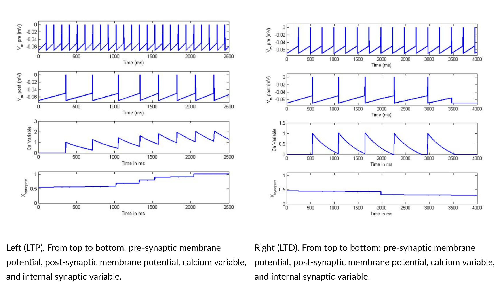
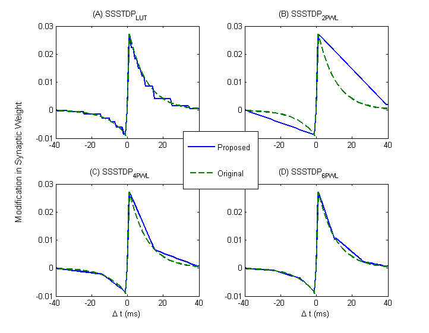

# Digital multiplier-less implementation of high precision SDSP and synaptic strength-based STDP

## Summary
		Spiking neural networks (SNNs) can achieve lower latency and higher efficiency compared to traditional neural networks if they are implemented in dedicated neuromorphic hardware. In both biological and artificial spiking neuronal systems, synaptic modifications are the main mechanism for learning.  Plastic synapses are thus the core component of neuromorphic hardware with on-chip learning capability. Recently, several research groups have designed hardware architectures for modeling plasticity in SNNs for various applications. Following these research efforts, this paper proposes multiplier-less digital neuromorphic circuits for two plasticity learning rules: the spike-driven-synaptic-plasticity (SDSP) and synaptic-strength-based spike-timing-dependent plasticity (SSSTDP).  The proposed architectures have increased the precision of the plastic synaptic weights and are suitable for spiking neural network architectures with more precise calculations. The proposed models are validated in MATLAB simulations and  physical implementations on a Field-Programmable Gate Array (FPGA). 
        
        [Paper Link](https://onlinelibrary.wiley.com/doi/abs/10.1002/cta.2753)


## Results





F I G U R E 5: Output of the proposed SDSP synapse in the minimal-size neural network model implemented on the
XILINX Spartan-6.





F I G U R E 6: Comparison of original synapse model with Output of the proposed models implemented on the
XILINX Spartan-6 (XC6SLX45) FPGA development board. (A) S S ST D PLUT . (B) S S ST D P2P W L . (C) S S ST D P4P W L .
(D) S S ST D P6P W L .


## Reference
```
@article{hajar_stdp,
    title = {Digital multiplier-less implementation of high-precision SDSP and synaptic strength-based STDP},
    journal = {International Journal of Circuit Theory and Applications},
    volume = {48},
    number = {5},
    author = {Asgari, Hajar and Mazloom-Nezhad Maybodi, Babak and  Sandamirskaya, Yulia},
    year = {2020},
    doi = {https://doi.org/10.1002/cta.2753}
}
```

## Info
This project is a subproject of the main FPGA implementation of spiking neural network with online learning capability project (Link). 